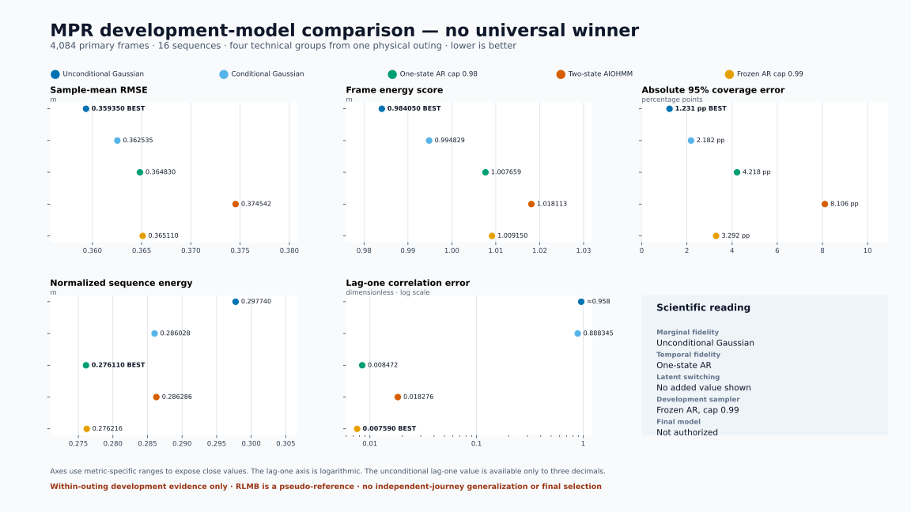
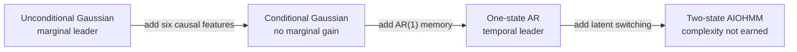

# Reviewed development-model comparison

This is the concise comparison to use in project meetings and the mid-term
presentation. It consolidates the accepted v0.14--v0.15.4 evidence without
refitting a model or adding a new post-hoc diagnostic. The primary cohort is
the same for every row: 4,084 frames in 16 sequences, grouped into four clean
technical recording groups from one longer same-day physical outing.

The most important conclusion is that there is **no universal winner**. The
unconditional Gaussian is strongest on marginal fidelity and calibration. A
one-state autoregressive model is decisively stronger on temporal fidelity.
The tested two-state latent switch does not earn its extra complexity. The
0.99 one-state AR remains the engineering development freeze, while final
model selection remains unauthorized until independent outings exist.



The figure is reproducible with:

```bash
MPLBACKEND=Agg python scripts/inspection/render_model_comparison.py
```

## What changed between the models



This progression isolates the value of each additional modeling assumption.
The comparison is not between unrelated pipelines: folds, evaluation rows,
training-only transformations, sample counts, and common metrics are held
fixed by the reviewed workflow contracts.

## Metric comparison

All scores below are macro-averaged over the four held-out technical groups.
Lower is better except for coverage itself, whose nominal target is 0.95.

| Model | Sample-mean RMSE (m) | Frame energy (m) | Normalized sequence energy (m) | 95% coverage | Lag-one error | Main reading |
|---|---:|---:|---:|---:|---:|---|
| Unconditional Gaussian | **0.359350** | **0.984050** | 0.297740 | **0.937690** | approximately 0.958 | Best marginal location, distribution, and calibration |
| Six-feature conditional Gaussian | 0.362535 | 0.994829 | 0.286028 | 0.928183 | 0.888345 | No marginal gain over the unconditional baseline; sequence energy is lower |
| One-state conditional AR, cap 0.98 | 0.364830 | 1.007659 | **0.276110** | 0.907818 | 0.008472 | Best complete-sequence energy and near-best temporal fidelity |
| Two-state AIOHMM, v0.15.0 | 0.374542 | 1.018113 | 0.286286 | 0.868940 | 0.018276 | Captures persistence, but is worse than one-state AR and more complex |
| Frozen one-state AR, cap 0.99 | 0.365110 | 1.009150 | 0.276216 | 0.917083 | **0.007590** | Best lag-one match; fixed development sampler, not a final selection |

The v0.15.2 convergence correction changed every two-state macro metric by at
most `4e-4`; it did not change the conclusion that the one-state AR is the
more defensible temporal model. The table retains the directly published
v0.15.0 row so its displayed precision remains traceable.

## What the metrics mean

| Metric | Question answered | Why it is needed | Important limitation |
|---|---|---|---|
| Sample-mean RMSE | Is the generated mean path-residual profile close to the observed profile? | Familiar measure of average point-prediction accuracy in metres | Does not test spread, joint shape, or time dependence |
| Multivariate frame energy score | Does the generated 21-station distribution match each observed H100 residual vector? | Proper sample-based score that evaluates joint frame-level distribution quality | Treats a frame at a time and therefore cannot validate temporal dynamics |
| Normalized sequence energy score | Does a free-running generated complete sequence resemble the observed sequence? | Tests the joint temporal-spatial output while controlling for sequence length | One scalar cannot diagnose whether an error is spatial or temporal |
| Marginal 95% coverage | Do station-wise generated intervals contain observations at approximately the advertised rate? | Standard calibration check; the target is 0.95 | Marginal coverage alone does not prove correct joint dependence |
| Lag-one correlation error | Does generation reproduce frame-to-frame persistence at each station? | Direct diagnostic of temporal structure | Can be excellent while marginal scale or calibration is poor |

Observed-history negative log-likelihood is also a proper and well-known
density metric for Gaussian and AIOHMM fits, but it is intentionally absent
from the cross-family headline plot. It is not available for every possible
sample-only model family, and observed-history likelihood does not test
free-running accumulation. Complexity measures such as parameter count,
training time, and inference time were not part of the frozen cross-model
evidence and must not be invented for presentation.

## Which model outperforms the others?

The answer depends on the property being evaluated:

- **Marginal winner: unconditional Gaussian.** It has the lowest RMSE and
  frame energy and the coverage closest to 0.95.
- **Temporal winner: one-state AR.** The reviewed 0.98 version has the lowest
  normalized sequence energy; the frozen 0.99 version has the lowest lag-one
  error. Both reduce lag-one error by roughly two orders of magnitude relative
  to either Gaussian baseline.
- **Complexity decision: one state over two.** The two-state AIOHMM does not
  improve the one-state AR on the five displayed metrics, so the observed
  evidence does not justify latent switching.
- **Development deployment: frozen one-state AR at 0.99.** The 0.99 ceiling is
  the smallest tested nonbinding ceiling and removes artificial boundary
  contact. It was selected structurally for planner development, not because
  it passed the strict v0.15.3 performance gate.
- **Final winner: none yet.** The four evaluation groups are portions of one
  outing, so they cannot establish transfer to independent journeys.

For a single presentation sentence:

> The unconditional Gaussian best matches frame-level marginals, while a
> one-state AR model best reproduces temporal sequences; latent switching did
> not help, and independent outings are still required for final selection.

## Planner evidence: why temporal structure matters

The later reference-planner experiments do not change the model-selection
result, but they show that the generative differences are operationally
meaningful under one fixed MPR-owned sensitivity simulation.

| Comparison | Reviewed result | Interpretation |
|---|---|---|
| Frozen AR order (A2) minus shuffled order (A1) | Integrated absolute lateral error `+0.176956 m s`; maximum absolute lateral error `+0.012402 m`; constraint-violation fraction `-0.093137`. All three paired-draw intervals exclude zero. | Temporal order changes planner behavior even when each draw retains the same residual profiles; the signs show a trade, not planner benefit. |
| Unconditional Gaussian (A3) versus frozen AR (A2) | A3 p95 curvature rate `1.938071` versus `0.168162`; A3 p95 lateral jerk `791.1659` versus `68.9550` (both about 11.5 times rougher). | Independent-frame sampling is much less smooth than autoregressive sampling. |
| A3 versus A2 deviation | Equal-sequence mean absolute lateral error is 16.2% lower for A3 and integrated absolute error is 5.2% lower, but the direction reverses in 5 of 15 sequences containing 57.9% of active frames. | The deviation result is length-dependent and cannot support a general winner. |
| Cross-station structure | Pooled adjacent correlation: A2 `0.703073`, A3 `0.968905`; A3 exceeds A2 for 182 of 210 station pairs. | A3 and A2 differ in spatial structure as well as temporal structure, so A3-minus-A2 is not a causal temporal comparison. |

Only A2-minus-A1 isolates temporal ordering. A3-minus-A2 changes marginal,
spatial, and temporal properties together. None of these results demonstrates
BMW-planner behavior, closed-loop safety, comfort, or production benefit.

## Evidence boundary and next decision

- RLMB is a pseudo-reference, not lane ground truth.
- The current comparison estimates within-outing technical-group transfer,
  not independent-journey generalization.
- The strict v0.15.3 performance gate remains failed.
- `final_model_selection_authorized=false` remains binding.
- RC-GAN, diffusion, another model family, or a new hyperparameter sweep is
  not justified on the same single-outing evidence.
- The next scientific comparison begins only after the prospective v0.17
  intake locks enough eligible independent SENSOR_TOPOLOGY outings.

## Provenance

The consolidated model values originate from the accepted v0.14 Gaussian,
v0.15.0 AIOHMM, v0.15.1 one-state-AR, v0.15.3 AR-boundary, and v0.15.4 freeze
artifacts. The principal consolidated source is
`ar_boundary_model_comparison.csv` in the immutable v0.15.3 output. Planner
values are the accepted v0.16, v0.16.1, and v0.16.2 outputs already recorded
in `docs/current_status.md` and their predeclarations. This document and its
figure are reporting views over accepted values; they are not new scientific
artifacts or authorization to run another current-data analysis.
