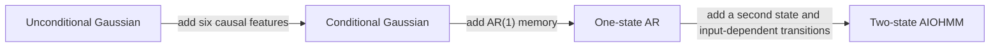

# Reviewed development-model comparison

This is the concise model comparison for project meetings and the mid-term
presentation. It compares the accepted v0.14--v0.15.3 outputs without refitting
a model or inspecting raw data. Every model uses the same primary cohort:
4,084 frames in 16 sequences, grouped into four technical recording groups
from one longer same-day physical outing.

There is no universal winner. The corrected two-state AIOHMM has the lowest
stored macro observed-history NLL, while the simpler models are stronger on
different free-running properties. Independent outings are still required
before final model selection.

## Generate the comparison directly from model outputs

The plotting script contains no metric values. It reads these two accepted
v0.15.3 files directly:

```text
ar_boundary_model_comparison.csv
ar_boundary_fold_comparison.csv
```

The v0.15.3 workflow generated those files only after validating the complete
lineage of the v0.14 Gaussian, corrected v0.15.2 AIOHMM, v0.15.1 one-state AR,
and v0.15.3 boundary-candidate outputs. Run:

```bash
python scripts/inspection/render_model_comparison.py \
  "outputs/models/one_state_ar_boundary_v0153" \
  --output \
  "outputs/reports/model_comparison_v0171/model_comparison.png"
```

Use a new output path if the file already exists. The command fails closed on
an unexpected CSV schema, model identity, artifact version, held-out-group
set, non-finite value, or disagreement between the stored macro mean and the
four fold rows.

The 16:9 Python figure contains only four conventional horizontal bar charts.
Each bar is a stored macro value, its exact value is printed beside it, and
green marks the lowest value in that panel. Every axis includes zero and is
linear, so bar lengths are not visually exaggerated. The renderer still reads
and reconciles all four held-out-group rows for the available sample metrics,
but it leaves those diagnostic points out of the main meeting figure. The
group-level qualifications remain documented below.

## Models being compared



The last arrow represents the tested v0.15.2 architecture. A two-state model
with fixed transitions was not tested, so the result must not be generalized
to every possible latent-state model.

## Four headline metrics

| Metric | What it measures | Why it remains in the figure |
|---|---|---|
| Mean observed-history negative log-likelihood (NLL) | Density assigned to held-out sequences while conditioning on the true previous residual | Standard probabilistic fit measure; lower is better |
| Sample-mean RMSE | Accuracy of the generated mean H100 residual profile in metres | Familiar marginal accuracy measure; lower is better |
| Normalized sequence energy score | Sample-based joint quality of a complete free-running sequence, normalized for length | Evaluates generated sequence distributions; lower is better |
| Median absolute lag-one correlation error | Median over 21 stations of the error in generated frame-to-frame correlation | Direct temporal-persistence diagnostic; lower is better |

NLL and the three sample metrics answer different questions. NLL is evaluated
under observed-history conditioning, commonly called teacher forcing. The
planner-facing sampler must instead run recursively from its own generated
history. A model can therefore improve NLL without improving free-running
generation. Negative NLL values are valid for continuous densities; the
comparison rule remains lower is better.

## Rounded reference values

The plot reads full-precision values from the CSVs. This table is only a
rounded reference for discussion.

| Model | Observed-history NLL | RMSE (m) | Sequence energy (m) | Median lag-one error |
|---|---:|---:|---:|---:|
| Unconditional Gaussian | -36.186 | 0.359354 | 0.297737 | 0.958332 |
| Six-feature conditional Gaussian | -36.184 | 0.362535 | 0.286028 | 0.888345 |
| One-state conditional AR, cap 0.98 | -40.967 | 0.364830 | 0.276110 | 0.008472 |
| Corrected two-state AIOHMM, v0.15.2 | -42.335 | 0.374553 | 0.286337 | 0.018340 |
| Frozen one-state AR, cap 0.99 | -40.967 | 0.365110 | 0.276216 | 0.007590 |

Green identifies only the lowest stored value for one metric; it does not mark
a universal winner. The table and figure report macro means. The available
group directions are not always unanimous, and the four groups are not
independent outings.

## Scientific interpretation

- **Observed-history density:** the corrected two-state AIOHMM has the lowest
  macro NLL, about 1.37 below either one-state AR. The latent switch therefore
  adds a macro density-fit advantage under teacher forcing; the consolidated
  fold file does not provide NLL values for a group-direction claim.
- **Marginal mean:** the unconditional Gaussian has the lowest macro RMSE, but
  only two of four held-out technical groups favour that ordering. Call it the
  lowest macro mean, not a general marginal winner.
- **Free-running sequence score:** the 0.98 one-state AR has the lowest macro
  sequence energy, but the 0.98-versus-0.99 direction splits two groups each.
  The caps are not distinguishable on this evidence by sequence energy.
- **Temporal persistence:** the frozen 0.99 AR has the lowest macro lag-one
  error, with three of four groups favouring it over 0.98. More importantly,
  the one-state AR beats the corrected two-state model on lag-one error in all
  four groups.
- **Complexity decision:** the non-degenerate two-state model fits observed
  histories better but does not retain that advantage across the free-running
  evaluation, particularly temporal fidelity. This is consistent with an
  observed-history/free-running mismatch; it does not by itself prove a causal
  mechanism. Because the planner consumes free-running sequences, one-state AR
  remains the more defensible development architecture.
- **Development freeze:** cap 0.99 remains fixed because it is the smallest
  tested nonbinding ceiling, not because it won a performance comparison.
- **Final selection:** no model is a final winner. The evidence is within one
  outing and `final_model_selection_authorized=false` remains binding.

For one presentation sentence:

> The two-state AIOHMM fits observed histories best, but the simpler one-state
> AR is more faithful in free-running temporal generation; the small
> macro-metric differences still require confirmation on independent outings.

## Planner relevance

The accepted planner evidence supports one concise point: temporal structure
matters. A2-minus-A1 isolates temporal ordering because A1 shuffles exactly
the same residual profiles within each sequence. A3-minus-A2 does not isolate
one cause because the unconditional Gaussian changes marginal, spatial, and
temporal structure together. The unconditional A3 samples were about 11.5
times rougher than A2 on p95 curvature rate and lateral jerk, while their
deviation result depended strongly on sequence length. These are sensitivity
results, not planner benefit or a general model ranking.

## Evidence boundary

- RLMB is a pseudo-reference, not lane ground truth.
- The four technical groups are portions of one outing, not four independent
  journeys or 4,084 independent observations.
- The renderer verifies the available fold rows against each stored macro
  value, but the simplified meeting figure does not plot them. The group-level
  results are descriptive, not confidence intervals or journey-level
  uncertainty estimates.
- The strict v0.15.3 performance gate remains failed.
- RC-GAN, diffusion, another model family, or a new current-data sweep is not
  justified until the prospective v0.17 intake locks enough eligible
  independent SENSOR_TOPOLOGY outings.

## Provenance

The comparison consumes the consolidated `ar_boundary_model_comparison.csv`
and `ar_boundary_fold_comparison.csv` from the immutable v0.15.3 output. Those
files trace to the v0.14.0 Gaussian baselines, v0.15.1 one-state AR, corrected
v0.15.2 two-state AIOHMM, and v0.15.3 AR candidates. The v0.15.4 freeze changes
only the packaging and development authorization of the 0.99 model; it does
not replace the v0.15.3 comparison values.
